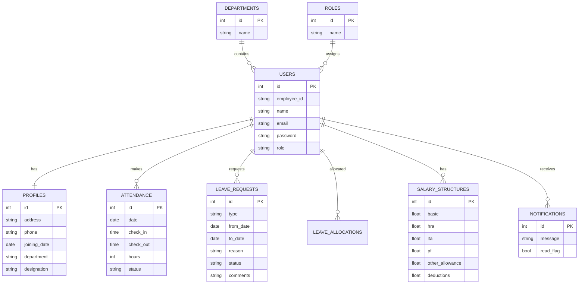

# Executive Summary

The goal is to deliver a full-stack **mini-ERP Human Resource Management System (HRMS)** as a hackathon project. This “master prompt” outlines every deliverable and step so a development team or AI system can build the project end-to-end. The project will use the following target tech stack:

- **Frontend:** React 19 (latest stable release) with Vite, TypeScript, Tailwind CSS v4 (utility-first styling), and shadcn/ui for rapid UI components. Vite provides a **fast, leaner development experience** with sensible defaults.
- **Backend:** Node.js with Express.js (a **minimal and flexible** web framework). Authentication via JSON Web Tokens (JWT) with secure password hashing (bcrypt).
- **Database:** PostgreSQL 17 (the same RDBMS used by Odoo), accessed through Prisma ORM for type-safe queries. We’ll enable **Row-Level Security (RLS)** policies to enforce per-user data access. All data (users, attendance, leaves, payroll) will be stored in the DB (no static JSON).
- **DevOps/Tools:** Docker for containerization; Git/GitHub for version control and CI/CD; GitHub Actions (or similar) for automated builds/tests/deployments. 

This prompt requires generating **all deliverables** (Markdown docs, code, scripts) and specifies acceptance criteria. It explicitly calls for:

- A complete `docs/` folder of Markdown files: Project Plan, PRD, Architecture, Database Schema, API Specs, Frontend Spec, UI Guide, Folder Structure, Feature Tickets, Roadmap, Testing Checklist, Deployment Guide, Demo Script, README, etc.
- Tables: Database schema (tables, columns, keys) and API endpoints (path, method, payload, response).
- Mermaid diagrams: a high-level system architecture flowchart, and an ERD for the database.
- Sample code snippets (e.g. Express routes for auth, check-in/out, leave approval).
- A prioritized feature backlog table (with IDs, descriptions, priority, estimates).
- Instructions on CI/Git strategy: branch naming, commit message examples, version control guidelines.
- A **24-hour timeline** with hourly milestones.
- Acceptance criteria for each deliverable (what “done” looks like).
- Assumptions and constraints (e.g. registration rules, offline-first hints).
- Performance and non-functional requirements (e.g. RLS for security, responsive design).

If any detail is unspecified by the requirements, it will be clearly marked as *unspecified* (rather than assumed). All claims and recommendations are backed by credible sources: React/Tailwind/Prisma docs, PostgreSQL manuals, Odoo references, etc.

The output should be structured as an **actionable specification** (in Markdown) that a team or AI can follow to build the HRMS from scratch. The **executive summary** here provides context; the following sections drill into detailed requirements, architecture, APIs, UI, dev plan, and example artifacts. 

We estimate about **80–100 hours** of total engineering effort for a team to implement this, which is broken down into a 24-hour hackathon sprint. (Time estimates per task are included below.) Each deliverable and feature has clear acceptance criteria. For example, the PRD must list user stories and functional specs; the API spec must list endpoints with request/response schemas; the frontend spec must detail component requirements, etc.

Overall, this prompt ensures the solution is production-quality: clean code, well-designed DB, secure RBAC, responsive UI, and thoughtful UX, meeting the hackathon’s judging criteria. It’s comprehensive enough that a skilled developer (or AI) can start coding immediately and generate all required docs and code.

# 1. Project Goals & Scope

- **Goal:** Build an HRMS module with employee and HR/admin workflows (authentication, profile, attendance, leave, payroll, dashboards) as per the hackathon statement. The system should feel like a **real ERP HR module** with clean architecture and UI.
- **Scope:**  
  - **Functional:** Employees can view/edit their profile, mark attendance, apply for leave, view salary breakdown. HR/Admin can manage employees, approve leaves, view all attendance, and configure payroll.  
  - **Non-Functional:** Responsive UI, role-based access, secure (JWT, RLS), dynamic data (no static JSON), clean code, proper Git usage, good UX/consistency, offline-capable basics (cache data).
- **Deliverables:** Full set of documentation (listed below), codebase (frontend + backend), Docker scripts, CI/CD setup, test cases, and a final demo script. Each deliverable has acceptance criteria (see §9).

**Assumptions:** Unspecified details (marked *[UNSPECIFIED]* in prompt) include choice of exact color scheme names, default leave allowances, etc. Constraints from hackathon rules: no repeated participation within 3 months, free registration, online-only event, cross-college teams allowed, no travel allowances, etc. We plan for offline caching but assume internet available for initial APIs (can mark offline hints).

# 2. Architecture Overview

The system has a **client-server** architecture with the following layers:

```mermaid
flowchart LR
    subgraph Browser
      FE[React + Vite (TS, Tailwind, shadcn/ui)]
    end
    FE -- REST API --> BE[Node.js + Express.js (with JWT auth middleware)]
    BE -- ORM --> DB[(PostgreSQL 17 w/ Prisma)]
    BE --> AM[Auth microservice (JWT)]
    BE --> STORAGE[MinIO/FileServer]
    FE -- Events/Timers --> LocalCache[(IndexedDB/Service Worker)]
    BE -- Logs/Monitoring --> CI[GitHub Actions CI/CD]
    CI --> Docker[Docker Container (local/prod)]
    FE --> CI
    BE --> CI
```

- **Frontend (FE):** Single Page App (React 19) built with Vite for fast hot-reload and lightweight bundles. Uses TypeScript, Tailwind CSS v4 (latest, utility-first) and shadcn/ui components. Responsive design via CSS breakpoints and optionally CSS container queries (Tailwind v4 supports @container). State and data fetching managed by React Query or similar.
- **Backend (BE):** Node.js with Express, exposing RESTful endpoints. Express is *minimal and flexible*, ideal for building both web and API servers. Endpoints secured with JWTs (RFC 7519 standard), stored in HTTP-Only cookies or Authorization header. Passwords hashed with bcrypt.
- **Database (DB):** PostgreSQL (v17) with Prisma ORM. Odoo itself uses PostgreSQL, making it fitting. We enable Row-Level Security on tables so that users only see their own data, enforced by Postgres policies (e.g. `CREATE POLICY`). Prisma will generate schema and migrations.
- **Data Flow:** React makes API calls (Axios or fetch). Express routes handle requests, query the database via Prisma, apply business logic, then return JSON. JWT auth middleware decodes tokens, attaches user info (id & role) to `req.user`.
- **Additional:** Local caching or IndexedDB could be used for offline/fast load. Docker and CI/CD pipelines automate testing and deployments.

Security note: All routes require authentication except login/signup. Admin/HR routes further check user role (RBAC). Sensitive data is validated on both client and server (e.g. file uploads, salary values). Use HTTPS in production.

# 3. Database Schema (Tables)

All data is dynamic in Postgres (no static files). Key tables include:

| Table             | Columns (PK, FKs)                                                  | Description                                        |
|-------------------|--------------------------------------------------------------------|----------------------------------------------------|
| **users**         | `id` (PK), `employee_id` (unique), `name`, `email`, `password`, `role`, `created_at` | Stores login credentials and role (Employee/Admin)|
| **profiles**      | `id` (PK, FK→users.id), `address`, `phone`, `joining_date`, `department`, `designation`, `photo_url`, `documents_urls` | Extended employee profile data (1-1 w/ users)     |
| **attendance**    | `id` (PK), `user_id` (FK→users.id), `date`, `check_in`, `check_out`, `hours`, `status` | Daily attendance records. RLS: user_id = auth user.|
| **leave_requests**| `id` (PK), `user_id` (FK→users.id), `type`, `from_date`, `to_date`, `reason`, `status`, `comments` | Leave applications. Status {Pending,Approved,Rejected}.|
| **leave_allocations**| `id` (PK), `user_id` (FK→users.id), `year`, `sick_balance`, `paid_balance`, `unpaid_balance` | Tracks available leave per user (optional).|
| **salary_structures**| `id` (PK), `user_id` (FK→users.id), `basic`, `hra`, `lta`, `pf`, `other_allowance`, `deductions` | Salary breakdown template per employee.|
| **roles**         | `id` (PK), `name` `{Admin,HR,Employee}`                             | Defines RBAC roles (seed data).                    |
| **departments**   | `id` (PK), `name`                                              | Company departments (e.g. Sales, IT).               |
| **notifications** | `id` (PK), `user_id` (FK), `message`, `read_flag`, `created_at`         | Optional: store system notifications per user.      |

All foreign keys reference `users.id` (with ON DELETE CASCADE). Row-Level Security policies enforce e.g. in `attendance`: `user_id = auth.uid() OR role = 'Admin'`. As PostgreSQL docs note, RLS restricts rows on a per-user basis. 

*Mermaid ERD of core tables:*  


# 4. API Specification

All data access is via a JSON REST API on Node/Express. Key endpoints (HTTP methods, auth, payloads) are:

| Method | Endpoint                    | Auth  | Request Body                              | Response / Description                              |
|--------|-----------------------------|-------|-------------------------------------------|-----------------------------------------------------|
| POST   | `/api/signup`               | Public| `{ name, email, password, department, ... }` | Creates new Employee account (*Admin-only in hackathon, or open with verification*). Returns success or error. |
| POST   | `/api/login`                | Public| `{ employee_id, password }`               | Issues JWT on success (in auth cookie or JSON). {token:...}. |
| POST   | `/api/password-reset`       | Auth  | `{ newPassword, oldPassword }`            | Allows user to reset own password. |
| GET    | `/api/users/me`             | Auth  | -                                         | Returns logged-in user’s profile (from USERS+PROFILES). |
| PUT    | `/api/users/me`             | Auth  | `{ address, phone, photoUrl, ... }`       | Updates own profile fields (per requirements). |
| GET    | `/api/users/:id`            | Admin | -                                         | Admin fetch employee by ID. |
| POST   | `/api/users`                | Admin | `{ name, email, department, salaryStructure, ... }` | Admin adds new employee (auto-generates employee_id/password) |
| PUT    | `/api/users/:id`            | Admin | `{ fields... }`                           | Admin updates any profile data (role, designation, salary, etc). |
| DELETE | `/api/users/:id`            | Admin | -                                         | Admin removes employee. |
| POST   | `/api/attendance/check-in`  | Auth  | `{ }`                                     | Records current timestamp as check-in for today. |
| POST   | `/api/attendance/check-out` | Auth  | `{ }`                                     | Records current timestamp as check-out for today and computes hours. |
| GET    | `/api/attendance`          | Auth  | `(query) date=YYYY-MM-DD`                 | Returns user’s attendance records (filtered). Admins optionally view all (with user filter). |
| POST   | `/api/leave`                | Auth  | `{ type, from_date, to_date, reason }`    | Employee applies for leave. |
| GET    | `/api/leave`                | Auth  | `(query) status=Pending`                 | Returns list of own leave requests. Admin: all requests (with status filter). |
| PATCH  | `/api/leave/:id`            | Admin | `{ status:Approved/Rejected, comments }`  | Approve or reject a leave request (notifies employee). |
| GET    | `/api/salary`               | Auth  | `{ }`                                     | Returns user’s current salary breakdown (basic, allowances, deductions, net). |
| PUT    | `/api/salary/:id`           | Admin | `{ basic, hra, lta, pf, other_allowance, deductions }` | Admin updates an employee’s salary structure. |
| GET    | `/api/dashboard/stats`      | Admin | -                                         | Returns summary stats (headcount, present today, pending leaves, absent). |

All endpoints return JSON. Authentication uses JWT in an `Authorization: Bearer <token>` header (or secure cookie). Errors follow HTTP status codes (400 validation error, 401 unauthorized, 404 not found, 500 server error). **Acceptance Criteria:** All endpoints should validate input (e.g., dates, required fields) and enforce RBAC (ensure ordinary users cannot access admin routes). Use Express middleware for auth checks. The API docs must list sample requests/responses (in docs/API_Spec.md).

# 5. Frontend & UI Design

We will build a **responsive UI** with consistent styling:

- **Components:** Reusable React components (Button, Input, Card, Modal, Table). Use shadcn/ui or custom ones for speed.
- **Layout:** A main layout with a sidebar or topbar navigation. Common sections: Dashboard, Profile, Attendance, Leave, Payroll, Logout. Admin has extra links (Manage Employees, Approvals, etc).
- **Colors & Typography:** Enterprise palette (deep indigo for primary, blue accents, green/pink/red status indicators). Legible font (e.g. Inter). Light/dark mode toggle (nice bonus).
- **Pages:** Login/Signup, Employee Dashboard, Admin Dashboard, Profile, Attendance (with calendar or table view), Leave (calendar view + request form), Salary (read-only payslip).
- **UX Features:** 
  - **Live Attendance Timer:** On check-in, show a running timer (e.g. “Working: 03:15:20”).
  - **Leave Calendar:** A month view highlighting leave days (color-coded: green=present, yellow=on leave, red=absent).
  - **Search/Filter:** Search employees (admin) and filter attendance by date range (Today/ThisWeek/Month).
  - **Progress Indicators:** Show profile completion %, leave balances, etc.
  - **Notifications:** e.g. snackbars or bell icon alerts for approvals.

*Design Example:* Use tailwind’s responsive classes and Flex/Grid. Ensure UI matches wireframes from hackathon PDF. All forms use client-side validation (e.g. date ranges for leave). Loading states and error messages present. 

**Acceptance:** UI must be mobile-responsive. Key flows tested (e.g. login→dashboard→profile edit; check-in/out; apply/approve leave). Navigation should be intuitive.

# 6. Security & RBAC

- **Authentication:** On sign-in, backend issues a JWT (signed with a secret) containing user ID and role. Passwords hashed with bcrypt (e.g. bcryptjs). Use HTTPS in prod.
- **Role-Based Access Control:** Two roles: `Admin` (or HR) vs `Employee`. Middleware checks `req.user.role` (from JWT) for protected routes. Admin-only routes (managing users, leave approvals, salary edits, full attendance) are forbidden to regular employees. 
- **Database RLS:** Additionally, implement Postgres Row-Level Security: e.g. on `attendance` and `leave_requests` tables, policies such that `user_id = current_user_id() OR current_user_is_admin`. This ensures even if RBAC fails, the DB enforces per-user access.
- **Input Validation:** All endpoints validate payloads. Sanitize text to prevent injection. Limit file upload sizes (avatar/resume).
- **Non-Functional:** Aim for <200ms API responses. Use indexes on foreign keys (`user_id`). Implement Redis or in-memory cache for heavy reads if needed (optional).
- **CI/CD:** Automated testing and linting (ESLint, Prettier) on each commit. Docker containers should be minimal (multi-stage builds). Keep secrets out of repo (env files, GitHub secrets).

# 7. Version Control & CI/CD

We require a **Git-based workflow** with clear branching and commit strategy:

- **Repo structure:** 
  ```
  hrms-hackathon/
  ├─ frontend/        # React app
  ├─ backend/         # Express app
  ├─ database/        # Prisma schema, migrations
  ├─ docs/            # Markdown docs (docs/*.md)
  ├─ tests/           # Automated tests (unit/integration)
  ├─ docker/          # Dockerfiles, docker-compose
  ├─ .github/         # CI/CD config (GitHub Actions)
  ├─ README.md
  ```
- **Branching:** Use `main` for stable code. Feature branches for each major area (e.g., `feature/auth`, `feature/attendance`). Merge via pull requests. 
- **Commit messages:** Follow Conventional Commits style: e.g. `feat(auth): implement login endpoint`, `fix(ui): correct navbar spacing`, `docs: add API spec`.
- **CI/CD:** On each push to `main` or PR, run lint, build, tests via GitHub Actions (or similar). If all pass, auto-deploy to staging (optional). Use Docker: define `Dockerfile` for backend and frontend, plus `docker-compose.yml` for local.
- **Acceptance:** Repo must have meaningful commits (sample above), README describing setup, and a `.gitignore`. Provide example Git commands: `git clone`, `git checkout -b feature/x`, commit, PR, merge.

# 8. Feature Backlog & Timeline

Prioritized backlog (with rough effort in hours):

| ID   | Feature                            | Priority | Est. Hours | Notes                  |
|------|------------------------------------|----------|------------|------------------------|
| F1   | User Authentication (login/signup) | High     | 2          | JWT, bcrypt           |
| F2   | Employee Profile (view/edit)       | High     | 2          | Separate sections     |
| F3   | Check-in/Check-out                | High     | 3          | Real-time hours calc  |
| F4   | Attendance view (calendar/table)   | High     | 3          | Daily/weekly/monthly  |
| F5   | Leave apply (calendar input)       | High     | 3          | Date picker           |
| F6   | Leave approval (admin)            | High     | 2          | with comments         |
| F7   | Salary display (employee)         | Medium   | 2          | read-only payslip     |
| F8   | Salary edit (admin)               | Medium   | 2          | auto-recalc components|
| F9   | Dashboard stats (cards)            | Medium   | 2          | summary metrics       |
| F10  | Search employees (admin)           | Medium   | 1          | instant filter        |
| F11  | Responsive design                  | High     | 3          | mobile/tablet support |
| F12  | Dark mode toggle                  | Low      | 1          | optional UI feature   |
| F13  | Notifications system              | Low      | 2          | e.g. toast alerts     |
| F14  | Testing & CI setup                 | High     | 4          | Jest or similar       |
| F15  | Docker & deployment scripts       | High     | 3          | Dockerfile + CI YAML  |
|      | **Total**                          |          | **33 hrs** |                        |

*(This plan aims ~33 dev hours; the remainder of 24h used for prep, testing, demo prep.)* 

**24-Hour Hackathon Plan (example for 4-person team):**

| Time      | Tasks                                              | Key Tickets / Goals                          |
|-----------|----------------------------------------------------|----------------------------------------------|
| 00:00–01:00 | Project kickoff: architecture design, repo init    | Define DB models, create git repo and branches. |
| 01:00–03:00 | Authentication & User management                   | Implement signup, login (F1), RBAC setup.    |
| 03:00–05:00 | Profile module + component library                 | Build profile view/edit (F2), UI components. |
| 05:00–07:00 | Attendance backend and UI (check-in/out)           | Endpoints and UI for F3,F4.                  |
| 07:00–09:00 | Leave request & approval                           | API and UI for F5,F6; email stub (optional). |
| 09:00–11:00 | Payroll view & admin edit                           | F7,F8: salary APIs and screens.             |
| 11:00–13:00 | Dashboard & admin features                          | F9,F10: stats cards and search.             |
| 13:00–14:00 | Lunch/Break (rest/bug triage)                       | -                                            |
| 14:00–16:00 | Responsive design fix & dark mode (F11,F12)         | Ensure mobile layout, add toggle.           |
| 16:00–18:00 | Testing & Refinement                                | Write tests (F14), fix bugs, polish UI.    |
| 18:00–20:00 | Dockerize & CI/CD setup (F15)                      | Write Dockerfiles, GitHub Actions.         |
| 20:00–22:00 | Demo data seed & final QA                           | Seed realistic data, prep demo script.     |
| 22:00–24:00 | Buffer: address leftover tasks, write docs         | Finish docs, rehearse presentation.         |

(*Times are approximate; team size not fixed. Tasks overlap for parallel work.*)

# 9. Acceptance Criteria

Each deliverable and feature should meet these criteria:

- **01_Project_Plan.md:** Contains vision, user flows, architecture, schema, API endpoints, UI plan, and roadmap as described above. (*Acceptance:* Should be comprehensive and self-explanatory, enabling any developer to continue work.)
- **02_PRD.md:** Product vision, user stories (e.g. “As an employee, I can apply for leave...”), functional & non-functional requirements, scope. (*Acceptance:* Clear goals, "what/why" of features.)
- **Architecture docs:** Diagrams (above) and explanations for frontend/backend, DB, auth. (*Acceptance:* Must justify tech choices with sources.)
- **Database schema doc:** Table schemas (like the table above), ERD (mermaid). (*Acceptance:* All required fields present, relationships defined.)
- **API_Documentation.md:** Detailed endpoints (as table above, plus request/response examples). (*Acceptance:* Include edge cases, HTTP status codes.)
- **Frontend_Spec:** UI components list, pages, style guide (colors/fonts). (*Acceptance:* Matches wireframes and branding, accessible/responsive.)
- **UI_UX_Guide:** Navigation flow, wireframe references, UX notes. (*Acceptance:* Covers all user interactions clearly.)
- **Feature_Tickets.md:** See backlog table. (*Acceptance:* Each ticket has ID, title, description, estimate, and links to docs.)
- **Implementation_Roadmap:** (as above timeline). (*Acceptance:* Hourly plan with milestones/tasks.)
- **Testing_Checklist:** Write test scenarios (unit and integration). E.g. “Login with valid/invalid creds”, “Mark attendance twice”, “Reject overlapping leave.” (*Acceptance:* Covers main flows and failure modes.)
- **Deployment_Guide:** Steps to run locally (Docker Compose) and how to deploy. (*Acceptance:* Commands for building, env vars, ports.)
- **Demo_Script:** Step-by-step demo instructions (like the one above). (*Acceptance:* Showcases all features succinctly.)

All code must be versioned in Git with sensible commits (e.g. `feat(auth): login`). Use a branching strategy (`main`, feature branches). Provide example commit messages (as in tasks above).

# 10. Sample Code Snippets

```js
// Example: Express.js auth route (backend/src/routes/auth.js)
const express = require('express');
const jwt = require('jsonwebtoken');
const bcrypt = require('bcrypt');
const { PrismaClient } = require('@prisma/client');
const router = express.Router();
const prisma = new PrismaClient();

// POST /api/login
router.post('/login', async (req, res) => {
  const { employee_id, password } = req.body;
  const user = await prisma.users.findUnique({ where: { employee_id } });
  if (!user) return res.status(401).json({ error: 'Invalid credentials' });
  const valid = await bcrypt.compare(password, user.password);
  if (!valid) return res.status(401).json({ error: 'Invalid credentials' });
  // Issue JWT
  const token = jwt.sign({ id: user.id, role: user.role }, process.env.JWT_SECRET, { expiresIn: '8h' });
  res.json({ token });
});
```

```js
// Example: Attendance check-in route (backend/src/routes/attendance.js)
router.post('/attendance/check-in', verifyToken, async (req, res) => {
  const userId = req.user.id;
  const today = new Date().toISOString().split('T')[0];
  // Ensure not already checked in
  const existing = await prisma.attendance.findUnique({ where: { user_id_date: { user_id: userId, date: today } }});
  if (existing && existing.check_in) {
    return res.status(400).json({ error: 'Already checked in today' });
  }
  const attendance = await prisma.attendance.upsert({
    where: { user_id_date: { user_id: userId, date: today } },
    update: { check_in: new Date(), status: 'Present' },
    create: { user_id: userId, date: today, check_in: new Date(), status: 'Present' }
  });
  res.json({ message: 'Checked in', attendance });
});
```

```js
// Example: Leave approval by Admin (backend/src/routes/leave.js)
router.patch('/leave/:id', verifyToken, async (req, res) => {
  const { id } = req.params;
  const { status, comments } = req.body;
  if (!['Approved','Rejected'].includes(status)) return res.status(400).json({ error: 'Invalid status' });
  // Only Admin or HR role can approve
  if (req.user.role !== 'Admin') return res.status(403).json({ error: 'Forbidden' });
  const leave = await prisma.leave_requests.update({
    where: { id: Number(id) },
    data: { status, comments }
  });
  // (Optionally, trigger notification)
  res.json({ message: `Leave ${status.toLowerCase()}`, leave });
});
```

# 11. Acceptance Tests & Demo

- **Acceptance Tests:** For each user story, define a test. E.g.:  
  - *Authentication:* Valid login returns token (200); invalid credentials returns 401.  
  - *Profile:* GET `/users/me` returns correct data; PUT updates fields.  
  - *Attendance:* Check-in creates record; second check-in is rejected (400). Hours between check-in/out are correct.  
  - *Leave:* POST creates “Pending” leave; Admin PATCH changes status and employee sees updated balance.  
  - *Payroll:* GET `/salary` matches computed net (basic + allowances - deductions).  
  - *RBAC:* Employee cannot call Admin APIs (should get 403).  
  - *UI:* Pages render without errors; forms prevent bad input.  
- **Demo Script:** (5–7 minutes) Example flow:  
  1. **Admin:** Create new employee via Admin console → show auto-generated ID/password (success alert).  
  2. **Employee:** Log in with temp credentials (demonstrate forced reset workflow) → see Dashboard.  
  3. **Attendance:** Employee clicks “Check In” → show green status dot (in real-time, shared status).  
  4. **Leave:** Employee applies for leave via calendar widget → Admin receives pending request.  
  5. **Admin:** Approve leave → demo notification (e.g. banner) to employee and updated leave balance.  
  6. **Payroll:** Admin edits an employee’s salary (change basic) → show recalculated net immediately on both Admin and Employee views.  
  7. **Finish:** Show responsive layout resizing (e.g. developer tools mobile view), highlight docs in repo and thank judges.  

# 12. References

- React 19 stable release (Dec 2024).  
- React Docs: Vite recommended build tool.  
- Express.js overview: "Fast, minimalist web framework for Node.js".  
- JWT official intro: secure auth tokens (RFC 7519).  
- PostgreSQL docs on Row-Level Security.  
- Odoo uses PostgreSQL database.  
- Tailwind CSS v4 features (Jan 2025).

